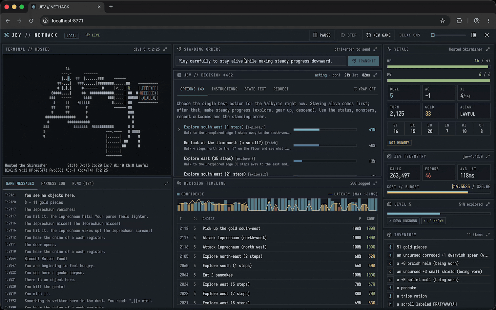

# nethack-jev

> [!NOTE]
> All code in this repository was written with [Claude Code](https://claude.com/claude-code) and Claude Opus 5.5.

[Jev](https://typesafe.ai) plays NetHack 5.0. Jev is the `systemone` model from TypeSafe. No LLM is in the loop.



## How it works

Jev does not write text or type commands. It only picks one answer from a list. This project uses that as follows:

1. The code reads the game screen from the terminal.
2. The code makes a list of the legal options for this turn. Examples are: attack a monster, explore, eat, pray, go down the stairs, kick a door, and dig.
3. Jev gets the list as a `choice` question and picks one option.
4. A "motor" (a small part of the code) does the keystrokes for that option.

## Inspiration

This project is inspired by two other projects:

- [An LLM ascends in NetHack](https://kenforthewin.github.io/blog/posts/llm-nethack-ascension) by kenforthewin. An LLM played NetHack and won the game. This project tries to do the same with Jev, and without an LLM.
- [Jev Plays Doom](https://github.com/olivier-motium/jev-doom) by olivier-motium. Jev played Doom. This project copies its structure: code makes a list of options, Jev picks one, and a motor does the keystrokes. Some methods also come from it, such as the safety check and the limit on the number of options.

## Run locally

You need Python 3, Node.js, and a Jev API key.

```sh
scripts/build-nethack.sh                    # builds Hardfought's NetHack50 fork into ./nethack
/opt/homebrew/bin/python3 -m venv .venv && .venv/bin/pip install -r requirements.txt
(cd web && npm install && npm run build)    # builds the dashboard into web/dist
echo 'JEV_API_KEY=...' > .env
.venv/bin/python -m jev.server              # http://127.0.0.1:8770
```

Open http://127.0.0.1:8770 to see the dashboard. The dashboard shows:

- The live game screen
- The options for this turn, with the probability that Jev gave each one
- The history of decisions and the money spent
- The records of past games

From the dashboard, you can pause the game, step one turn, change the speed, and start a new game. You can also give Jev a standing order.

The default spend limit is $5. To change it, set `JEV_BUDGET_USD` in `.env`. Each game writes its decisions to `runs/<id>/decisions.jsonl`.

## Play on Hardfought

1. Add your account to `.env`:

   ```sh
   HARDFOUGHT_USERNAME=...
   HARDFOUGHT_PASSWORD=...
   ```

2. Paste `jev/nethackrc` into your NetHack 5.0 options file at https://www.hardfought.org/nethack/rcedit/. You do this one time only.
3. Start the server:

   ```sh
   .venv/bin/python -m jev.server --hardfought
   ```

The server connects through the web terminal of Hardfought (`jev/wsbridge.py`), because some networks block port 22. To connect with SSH instead, set `HARDFOUGHT_SSH=1`.

## Watch in a terminal

The server must be running. Open a terminal that is at least 80 columns by 40 rows, and run:

```sh
.venv/bin/python -m jev.watch
```

The watcher shows the live game screen in color. Below the screen, it shows:

- The options for this turn, with their probabilities
- The last decisions and their results
- The money spent on the Jev API
- Recent deaths

To stop the watcher, push Ctrl-C.

## More information

`JOURNAL.md` is the development log. It records each finding and decision in time order.

The web UI uses the [SMUI](https://smui.statico.io) theme for shadcn/ui.

## License

MIT. See `LICENSE`.
